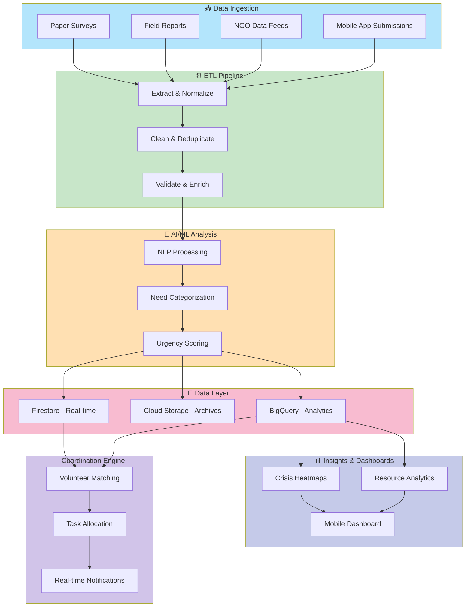
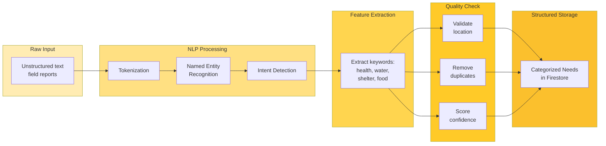
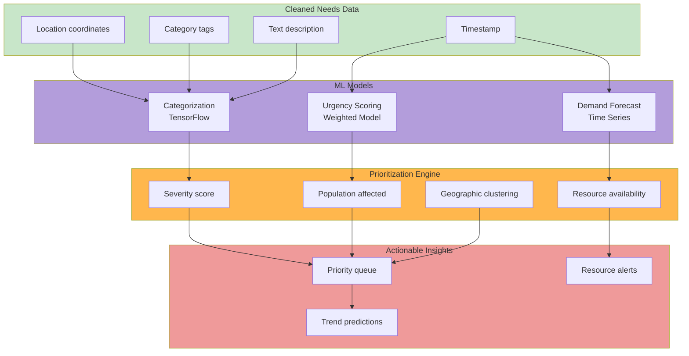
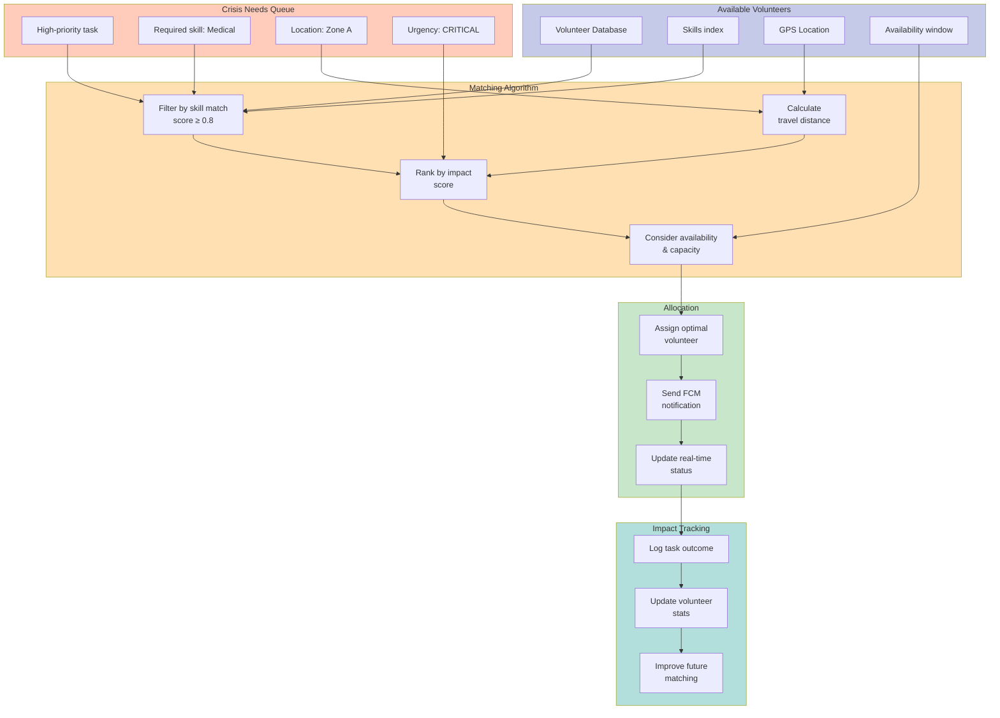
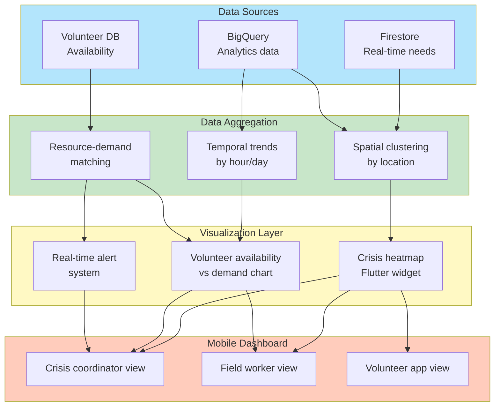

<p align="center">
  
</p>


# 🚨 Crisis Response & Volunteer Coordination Platform

**Real-time intelligent matching system that connects verified volunteers to critical needs during crises.**

> Transform chaos into coordination. Aggregate data from multiple sources, intelligently analyze needs, and deploy volunteers where impact is greatest—all in real-time.

---

## 🎯 The Problem We Solve

During crises (natural disasters, health emergencies, pandemics), critical information flows through fragmented channels—field reports, NGO submissions, mobile crowdsourcing, paper forms. This leads to:
- **Information silos** → Missed critical needs
- **Manual coordination** → Delayed response
- **Misallocated volunteers** → Wasted resources  
- **No visibility** → Decision paralysis

Our platform unifies, analyzes, and acts—automatically.

---

## ✨ Key Features

- **Multi-source data ingestion** — Paper surveys, field reports, NGO feeds, mobile crowdsourcing
- **AI-powered need analysis** — NLP extracts intent, ML categorizes urgency, predicts future demand
- **Real-time dashboards** — Heatmaps of critical areas, volunteer availability vs. demand
- **Intelligent volunteer matching** — Skill + proximity + urgency-based allocation
- **Crisis alerts** — Automated escalation for emerging hotspots
- **Cross-platform mobile app** — Flutter for field workers and volunteers

---

## 🏗️ System Architecture



---

## 🔄 Data Processing Pipeline



---

## 🧠 AI/ML Analysis Pipeline



---

## 🎯 Volunteer Matching Algorithm



---

## 📊 Visualization & Analytics Pipeline



---

## 🛠️ Tech Stack

### **Backend & Data**
| Layer | Technologies |
|-------|---------------|
| **Backend** | Node.js, Django, Spring Boot |
| **Real-time DB** | Firebase Firestore |
| **Data Warehouse** | Google BigQuery |
| **Storage** | Google Cloud Storage, AWS S3 |
| **APIs** | RESTful, GraphQL |
| **Message Queue** | Cloud Pub/Sub, Kafka |

### **AI/ML**
| Component | Stack |
|-----------|-------|
| **NLP** | TensorFlow, spaCy, NLTK |
| **Categorization** | Google Cloud AI, Vertex AI |
| **Matching Algorithm** | Python, scikit-learn |
| **Predictions** | Time series (Prophet, LSTM) |

### **Frontend & Mobile**
| Platform | Tech |
|----------|------|
| **Mobile App** | Flutter (iOS/Android) |
| **Web Dashboard** | React, D3.js for maps/charts |
| **Real-time Updates** | WebSockets, Firebase |

### **DevOps & Infrastructure**
| Service | Tools |
|---------|-------|
| **Containers** | Docker, Kubernetes |
| **CI/CD** | GitHub Actions, Jenkins |
| **Cloud** | Google Cloud Platform / AWS |
| **Monitoring** | Datadog, CloudWatch, Prometheus |

### **Supporting Tools**
| Category | Tools |
|----------|-------|
| **Version Control** | Git, GitHub |
| **Collaboration** | Jira, Slack, Confluence |
| **Security** | OAuth 2.0, JWT, encryption |

---

## 📂 Project Structure

```
crisis-response-platform/
├── backend/
│   ├── api/                 # REST endpoints
│   ├── services/
│   │   ├── etl/            # Data pipeline
│   │   ├── nlp/            # NLP processing
│   │   └── matching/       # Volunteer matching
│   ├── models/             # DB schemas
│   └── config/
│
├── ml/
│   ├── notebooks/          # Jupyter notebooks
│   ├── models/             # Trained ML models
│   ├── preprocessing/      # Data prep scripts
│   └── evaluation/         # Model metrics
│
├── mobile/
│   ├── lib/
│   │   ├── screens/        # UI screens
│   │   ├── services/       # Firebase, APIs
│   │   └── widgets/
│   └── pubspec.yaml
│
├── web/
│   ├── src/
│   │   ├── components/     # React components
│   │   ├── pages/
│   │   └── services/
│   └── package.json
│
├── infrastructure/
│   ├── docker/             # Docker configs
│   ├── kubernetes/         # K8s manifests
│   └── terraform/          # IaC
│
├── docs/
│   ├── architecture.md
│   ├── api.md
│   └── deployment.md
│
└── README.md
```

---

## 🚀 Quick Start

### Prerequisites
```bash
Node.js 16+
Python 3.9+
Flutter 3.0+
Google Cloud SDK
Docker & Docker Compose
```

### Installation

1. **Clone the repository**
```bash
git clone https://github.com/yourorg/crisis-response-platform.git
cd crisis-response-platform
```

2. **Backend setup**
```bash
cd backend
npm install
cp .env.example .env
npm run dev
```

3. **ML pipeline setup**
```bash
cd ml
python -m venv venv
source venv/bin/activate
pip install -r requirements.txt
python scripts/train_models.py
```

4. **Mobile app setup**
```bash
cd mobile
flutter pub get
flutter run
```

5. **Web dashboard setup**
```bash
cd web
npm install
npm start
```

---

## 📈 Key Metrics & Impact

- **Data ingestion latency**: < 5 seconds
- **Volunteer matching time**: < 30 seconds
- **System uptime**: 99.9% SLA
- **Volunteer-to-task match accuracy**: 87%+
- **Coverage radius**: Up to 50 volunteers per critical incident

---

## 🔐 Security & Privacy

- **Data encryption**: AES-256 at rest, TLS 1.3 in transit
- **Authentication**: OAuth 2.0 + JWT tokens
- **Compliance**: GDPR, CCPA, local regulations
- **Audit logs**: All data access tracked and encrypted
- **Volunteer consent**: Explicit opt-in for location tracking

---

## 🤝 Contributing

We welcome contributions! Please follow these steps:

1. Fork the repository
2. Create a feature branch (`git checkout -b feature/amazing-feature`)
3. Commit your changes (`git commit -m 'Add amazing feature'`)
4. Push to the branch (`git push origin feature/amazing-feature`)
5. Open a Pull Request

See [CONTRIBUTING.md](CONTRIBUTING.md) for detailed guidelines.

---

## 📚 Documentation

- [Architecture Deep Dive](docs/architecture.md)
- [API Reference](docs/api.md)
- [Deployment Guide](docs/deployment.md)
- [ML Model Documentation](docs/ml-models.md)

---

## 📝 License

This project is licensed under the MIT License — see [LICENSE](LICENSE) file for details.

---

## 🙌 Support & Community

- **Issues & Bug Reports**: [GitHub Issues](https://github.com/yourorg/crisis-response-platform/issues)
- **Discussions**: [GitHub Discussions](https://github.com/yourorg/crisis-response-platform/discussions)
- **Email**: team@crisisresponse.org

---

## 🎓 Acknowledgments

Built with ❤️ by volunteers, for volunteers. Special thanks to NGOs, field workers, and crisis responders who informed this platform's design.

---

**Last Updated**: April 2026  
**Maintained by**: [Your Team Name]  
**Status**: 🟢 Production Ready
